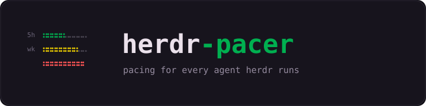

<p align="center">
  
</p>

<p align="center">
  <a href="https://herdr.dev/plugins/"></a>
  <a href="https://github.com/amali01/herdr-pacer/stargazers"></a>
</p>

Pacing for the agents [Herdr](https://herdr.dev) runs, in three places:

- **Per session** — dotted bars under each agent row in the sidebar: that
  session's context window, and if you like the **5h** and **weekly** windows
  of the account it runs on, colored by how full they are. Claude Code, Codex,
  and OpenCode.
- **Globally** — a dock along the bottom of every tab with the **5h**,
  **weekly** and, if you want it, **monthly** windows for Codex, Claude, and
  OpenCode, same bars, same colors. The prefix key then `u` or `U`
  (`ctrl+b u`) shows or hides it; its `⚙`, `⟳` and `✕` buttons open the
  settings, refresh, and hide it with the mouse.
- **In the tab bar**, if you turn it on — a segment per agent at the right of
  Herdr's tab bar: `Claude 5h ⣤⣤⣤⣤⣤⣤ 98% · wk ⣤⣤⣀⣀⣀⣀ 34%`.

<p align="center">
  
</p>

One number means the same thing wherever it appears: green below 50%, orange
50-69, yellow 70-89, red from 90 — the thresholds [cc-pacer](https://github.com/amali01/cc-pacer)
uses, so the two read alike if you run both. Monthly and billing windows are
deliberately left out; this is about pace.

## How it works

Two paths, no polling. Context bars are pushed when a session says something
new — Claude reports itself from its status line, and for Codex and OpenCode
Herdr pokes us on `pane.agent_status_changed`, which is exactly when a turn
ends. The 5h and weekly numbers are fetched on demand, cached, and refreshed
every minute while a dock or the popup is open. Every dock and the popup share
one cache, so a dock per tab still costs one fetch a minute.

### The sidebar rows

Herdr has no plugin API for drawing in the sidebar, but agent rows accept custom
`$tokens` reported per pane, and a row whose tokens are all unreported
disappears. So the bars ride on pane metadata, and show up only for sessions
that report one — and only for what the settings turn on.

```
ctx  58% ⣤⣤⣤⣤⣤⣤⣀⣀⣀⣀      a row each                ctx 58%⠀5h 13%⠀wk 49%    one line
5h   13% ⣤⡄⣀⣀⣀⣀⣀⣀⣀⣀
wk   49% ⣤⣤⣤⣤⣤⣀⣀⣀⣀⣀
```

On one line the bars shrink with the number of metrics — a full bar for one, a
stub for two, the numbers alone for three — so the line fits the sidebar.

Two details made it work:

- **`herdr-glue.patch`** adds a `glue = true` token option to Herdr. Stock Herdr
  always inserts `" · "` between row tokens, which would run straight through
  the middle of every bar. With glue, the used half and the rail are two
  differently styled tokens rendered flush.
- **The bar carries its color in its token name.** Herdr's `rules` can recolor a
  token by value, but only when the value parses as a number — and a bar is
  braille. So each metric reports exactly one of `pacer_<m>_{ok,warn,hot,crit}`
  (label, percentage and the used dots) and clears the other three, and
  `pacer_<m>` is the gray rail; `config.toml` gives each its color. Five tokens a
  metric keeps all three on one line inside Herdr's limit of 16 a row.

Herdr does not accept unsolicited pull requests (see its `CONTRIBUTING.md`), so
the patch lives here and is re-applied per release with `./herdr-build.sh`.

### The usage dock

Herdr gives plugins no room of their own outside the tab, so the dock is an
ordinary pane that `herdr-pacer ensure` keeps along the bottom with stock API
calls — no patch. The approach is [herdr-sidebar](https://github.com/alexarthurs/herdr-sidebar)'s.

- **Where it goes.** On `tab.created`, `tab.focused` and `workspace.focused`
  the hook docks the current tab if it has no dock yet: it splits the
  bottom-left pane down, then widens the dock to the full tab by bouncing each
  pane beside it through a temporary tab and splitting it back next to the pane
  above. `pane.move` keeps their processes; the layout around them does change.
  Your focus stays where it was.
- **Size.** A row per window it shows, a title row, and the pane border. Drag
  the border to resize it; a dock that is already there is only resized again
  when the windows it shows change.
- **Responsive.** Each agent is a column, and a column gives up detail as the
  dock narrows or the agents multiply: the reset time first, then bar cells,
  then the bar itself (`5h 97%`). When even the numbers do not fit, it shows
  the agents that do and a `+N` for the rest.
- **Show and hide** apply to every tab: `prefix+u` or `prefix+U`, or `✕` on
  the dock. Nothing else is bound, so `ctrl+u` still reaches your shell. Hidden
  means gone, not shrunk. Shown again, it comes back in the current tab and in
  the others as you visit them.
- **No scroll, no flicker.** The dock draws on the terminal's alternate screen,
  which has no scrollback, and paints each frame over the last instead of
  clearing first. Numbers are fetched in the background into a cache every dock
  shares, so a dock per tab costs one fetch a minute.
- **Never mistaken for an agent.** Herdr names a pane's agent from its
  foreground process group, and fetching Codex usage means running
  `codex app-server`. The dock starts it in a process group of its own, so the
  dock never shows up in the agent list as a Codex session.
- **Restarts.** Herdr restores panes without their command, so a restored dock
  is a shell that kept its label and the plugin's directory; the hook replaces
  it with a live one.

The full popup is still there as the `herdr-pacer.open` action.

### The tab bar

Off until you pick agents for it in the settings. Each agent then gets a
`[ui] tab_bar_right` command in `config.toml` — Herdr's own way to put text in
the tab bar — which it runs every 30 seconds and shows the last line of. The
inspiration is [herdr-status-ui-bar](https://github.com/speardragon/herdr-status-ui-bar);
the segments are drawn by the same binary from the same cache as the dock.

- **Plain text.** Herdr strips color from the tab bar, so the bar's shape
  carries how full a window is; `numbers` drops it for `Claude 5h 98% · wk 34%`.
- **Your own entries stay.** A zoom indicator, a clock or another plugin's
  widget in `tab_bar_right` keeps its place; herdr-pacer's go last, and all of
  them come out again when no agent is on.
- **Changes show at once.** A settings change reloads Herdr's config, which
  runs the commands right away rather than at their next interval.
- **Never waits.** A segment prints from the cache; when that is stale it
  starts a fetch in the background and shows the numbers it has.

### Settings

`⚙` on the dock (or the `herdr-pacer.settings` action) opens a popup; click an
option or move with the arrows and press space. Every change applies at once.

```
Usage dock
  Agents     [x] Codex    [x] Claude   [x] OpenCode
  Windows    [x] 5h       [x] Weekly   [ ] Monthly
  Style      (•) Dots   ( ) Bar   ( ) Blocks  ( ) Slants
  Rows       ( ) 1 row    (•) 2 rows   ( ) 3 rows       ⣤⣤⣤⣤⣤⣀⣀⣀ 64%
Agent sidebar
  Show       [x] Context  [ ] 5h       [ ] Weekly
  Layout     (•) a row each            ( ) one line
  Style      (•) Dots   ( ) Bar   ( ) Blocks  ( ) Slants
  Rows       ( ) 1 row    (•) 2 rows   ( ) 3 rows       ⣤⣤⣤⣤⣤⣀⣀⣀ 64%
Tab bar
  Show       [ ] Codex    [ ] Claude   [ ] OpenCode
  Windows    [x] 5h       [x] Weekly   [ ] Monthly
  Style      (•) Dots   ( ) Bar   ( ) Blocks  ( ) Slants  ( ) numbers
  Rows       ( ) 1 row    (•) 2 rows   ( ) 3 rows       ⣤⣤⣤⣤⣤⣀⣀⣀ 64%
```

Each place draws its bars in a style of its own. The row under **Style** is
named for what it changes in that style, and a preview beside it shows the
result before you close the popup:

| Style | The row under it | Choices |
|---|---|---|
| **Dots** | Rows — how many dot rows | `⣀⣀⣀⣀` 1 row · `⣤⣤⣤⣀` 2 rows · `⣶⣶⣶⣀` 3 rows |
| **Bar** | Thickness | `▂▂▂▁` thin · `▄▄▄▁` medium · `▆▆▆▁` thick |
| **Blocks** | Shade — how solid the fill is | `▒▒▒░` light · `▓▓▓░` medium · `███░` solid |
| **Slants** | Size | `▰▰▰▱` — one size |

The tab bar also offers **numbers**, the percentages alone. Every style draws the
empty part in a different shape from the filled one, so a bar still reads in the
tab bar, where Herdr allows no color.

The sidebar's 5h and weekly bars are the account's, so a Claude session
shows Claude's windows and a Codex session Codex's; they refresh on each agent
turn, dock or no dock. The choices live in `settings.json` in the plugin's config
directory (`herdr plugin config-dir herdr-pacer`); switching the layout rewrites
the sidebar rows in `config.toml` and reloads Herdr.

## Install and update

herdr-pacer is one Rust binary, built by Herdr from source on install and on
update, so it needs a Rust toolchain (1.89 or newer; [rustup](https://rustup.rs))
and Herdr 0.9 or newer. `sqlite3` only if you want OpenCode's context bar.
Nothing else — herdr-pacer talks to Herdr over its socket and to each provider
on its own.

```sh
herdr plugin install amali01/herdr-pacer
herdr plugin action invoke herdr-pacer.setup
```

**Updating.** From 0.7.1 on, `herdr plugin action invoke herdr-pacer.update`
compares the installed version with the one on GitHub and installs it only when
it is newer; the same or an older version is left alone. From any earlier
version, run the install command again — Herdr replaces the checkout and
rebuilds, and the old version keeps running if the build fails. Either way,
the first hook the new build runs migrates the rest by itself, once: it rewraps
the Claude statusLine, brings the sidebar rows and the dock key in
`config.toml` up to date, carries old settings over, deletes state files older
versions left, and restarts the docks. There is no need to run `setup` again.

- Coming from a shell-script version (before 0.7), install a Rust toolchain
  first; the build says so if it is missing. `claude-statusline.sh` stays as a
  shim, so a statusLine wrapped by those versions keeps drawing until it is
  rewrapped.
- If you linked a checkout (`herdr plugin link`), Herdr will not install over
  it: `herdr plugin unlink herdr-pacer` first, or pull and
  `cargo build --release` in the checkout.

**The sidebar bars need a Herdr built with `herdr-glue.patch`.** Stock Herdr
inserts `" · "` between row tokens, straight through the middle of every bar, and
the option that suppresses it is not upstream (checked through v0.9.1). Without
the patch nothing breaks — the usage dock is plain plugin code and unaffected,
and the sidebar bar just renders as `used · rail`. To build one, run
`./herdr-build.sh` from the plugin directory (`herdr plugin list` prints it),
install the binary it leaves in `target/release/herdr`, then invoke `setup`
again.

Or work from a clone, which is also how you'd hack on it:

```sh
git clone https://github.com/amali01/herdr-pacer.git
cd herdr-pacer
cargo build --release
./herdr-build.sh            # builds a patched herdr; prints how to install it
herdr plugin link .
target/release/herdr-pacer setup
```

`setup` is idempotent, backs up every file it touches, and:

1. wraps the Claude Code statusLine with `herdr-pacer statusline`,
2. checks that the running Herdr understands `glue`,
3. adds the sidebar bar rows and the dock key to `config.toml`, and
4. reloads Herdr and restarts the docks, so they run the new build.

The wrapper is a pass-through: **whatever already drew your status line keeps
drawing it**, and the wrapper only reads the context percentage out of the
payload on its way past. If nothing was there before, it prints a minimal
`ctx N%` line of its own. `herdr-pacer claude-hook remove` puts the original
command back. An install from before the port — the shell scripts — is
upgraded in place: `setup` rewraps the statusLine around the same inner command.

## Where the numbers come from

| Reading | Source | Needs |
|---|---|---|
| Claude context | the statusLine payload (`context_window.used_percentage`) | the wrapper installed |
| Codex context | the composer footer — `pane.read` picks up the `Context N% left` the TUI already prints | nothing |
| OpenCode context | its SQLite: the last turn's `tokens.total` for the session in that pane's directory, over the model's context limit from opencode's models cache | `sqlite3` |
| Codex 5h / weekly | `codex app-server` → `account/rateLimits/read` | signed-in `codex` CLI |
| Claude 5h / weekly | `api.anthropic.com/api/oauth/usage` — cc-pacer's cache is reused when it happens to be warm | signed-in Claude Code |
| OpenCode 5h / weekly | `omp usage --json` | `omp` on `PATH` |

A startup sweep covers sessions that were already running when Herdr started.

No credential file is written, and the Claude bearer token never leaves the
process: the request is made in-process, not by a command whose arguments
anyone can list. The OpenCode database is opened read-only.

## Files

| File | Purpose |
|---|---|
| `src/main.rs` | The `herdr-pacer` subcommands |
| `src/usage.rs` | Provider collectors, the shared cache, the dotted bar, the thresholds |
| `src/tui.rs` | The dock (`herdr-pacer dock`) and the popup (`herdr-pacer popup`) |
| `src/dock.rs` | Keeps the dock along the bottom of every tab: `ensure` / `toggle` |
| `src/context.rs` | Sidebar bars and their `config.toml` rows; the `statusline` wrapper, `claude-hook`, `panes` for Codex and OpenCode |
| `src/settings.rs` | What the dock and the sidebar show, as `settings.json` |
| `src/panel.rs` | The settings popup (`herdr-pacer settings`) |
| `src/tabbar.rs` | The tab bar segments (`herdr-pacer tabbar <agent>`) |
| `src/setup.rs` | One-command setup |
| `src/upgrade.rs` | `update` (installs only a newer version) and the once-per-version migration |
| `claude-statusline.sh` | A shim for statusLines wrapped by the shell-script versions |
| `src/herdr.rs` | Herdr's socket API |
| `herdr-glue.patch` | The Herdr change the bars need |
| `herdr-build.sh` | Clones Herdr, applies the patch, builds it |
| `herdr-plugin.toml` | Plugin manifest: build, hooks, actions, the popup, settings and dock panes |

`cargo test` covers the bar and its thickness, the thresholds, reset-time
parsing, the Codex limits, the dock's layout math and how its strip narrows,
the sidebar tokens and rows in both layouts, the settings file and popup, the
statusLine quoting, and the `config.toml` migration.

## Knobs

| Env var | Default | Meaning |
|---|---|---|
| `HERDR_PACER_CTX_CELLS` | `10` | Width of a sidebar bar, in cells, when each metric has its own row |
| `HERDR_PACER_BAR_CELLS` | `20` | Width of the bars in the popup (docks fit theirs to the pane) |
| `HERDR_PACER_CTX_TTL_MS` | `300000` status line, 6h sweeps | How long a session's bar outlives its last refresh |
| `HERDR_PACER_EVENT_SETTLE` | `1.5` | Seconds to let a TUI repaint before reading it |
| `HERDR_PACER_OPENCODE_DB` | `~/.local/share/opencode/opencode.db` | OpenCode's database |
| `HERDR_PACER_OPENCODE_MODELS` | `~/.cache/opencode/models.json` | Where context limits come from |
| `HERDR_PACER_REFRESH_SECONDS` | `60` | Dock and popup auto-refresh |
| `HERDR_PACER_CLAUDE_REFRESH` | `300` | Seconds before we fetch Claude usage ourselves |
| `HERDR_PACER_STATE_DIR` | `$XDG_STATE_HOME/herdr-pacer` | Usage cache location |

Colors live in `config.toml`, not in the reporter — Herdr styles the tokens.

## Credits

- [Kamyil/herdr-usage-popup](https://github.com/Kamyil/herdr-usage-popup) — provider collectors.
- [amali01/cc-pacer](https://github.com/amali01/cc-pacer) — where the Claude usage
  endpoint and the color thresholds came from. **Not a dependency:** herdr-pacer
  fetches usage itself and only borrows cc-pacer's cache when it is already warm,
  and if cc-pacer is drawing your status line the wrapper leaves it drawing it.

MIT, except `herdr-glue.patch`, which is a change to Herdr and carries Herdr's
Apache-2.0 license.
